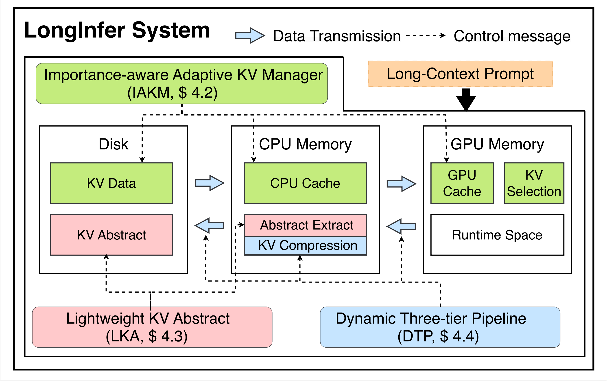

# LongInfer: Efficient Long-Context LLM Inference with Adaptive KV Data Extraction on a Commodity GPU

## Overview

This repository contains the code of our paper "LongInfer: Efficient Long-Context LLM Inference with Adaptive KV Data Management on a Commodity GPU".



## Abstract

Advanced Large Language Models (LLMs) have achieved impressive performance across a wide range of complex and long-context natural language tasks. However, performing long-context LLM inference locally on a commodity GPU (a PC) with privacy concerns remains challenging due to the increasing memory demands of the key-value (KV) cache. Existing systems typically identify important tokens and selectively offload their KV data to GPU and CPU memory. The KV data needs to be offloaded to disk due to the limited memory on a commodity GPU, but the process is bottlenecked by token importance evaluation overhead and the disk’s low bandwidth. In this paper, we present LongInfer, the first efficient importance-aware long-context LLM inference system for a single commodity GPU with adaptive hierarchical GPU-CPU-Disk KV management. Our system employs an adaptive KV management strategy that partitions KV data into variable-sized chunks based on the skewed distribution of attention weights across different layers to reduce computational and additional transmission overheads. Moreover, we propose a lightweight KV abstract method, which minimizes transmission latency by storing and extracting the KV abstract of each chunk on disk instead of the full KV data. LongInfer also leverages the dynamic compression and pipeline techniques to further accelerate inference. Experimental results demonstrate that LongInfer achieves an average inference latency speedup of $3.46\times$, while maintaining comparable LLM response quality. In scenarios with larger batch sizes, it achieves up to a $5.47\times$ speedup.

## Quick Start 
```sh
git clone https://github.com/ustc-sunny/Long_Infer_KV.git
conda create -n LongInfer python=3.9
conda activate LongInfer
pip install -r requirements.txt
```
